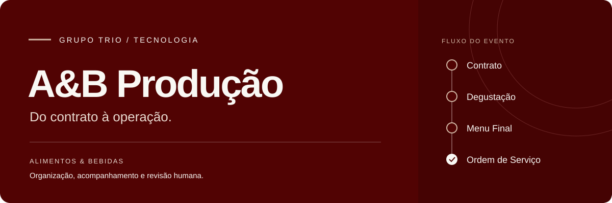
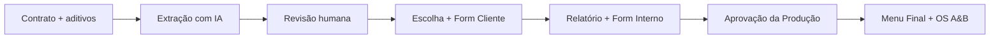
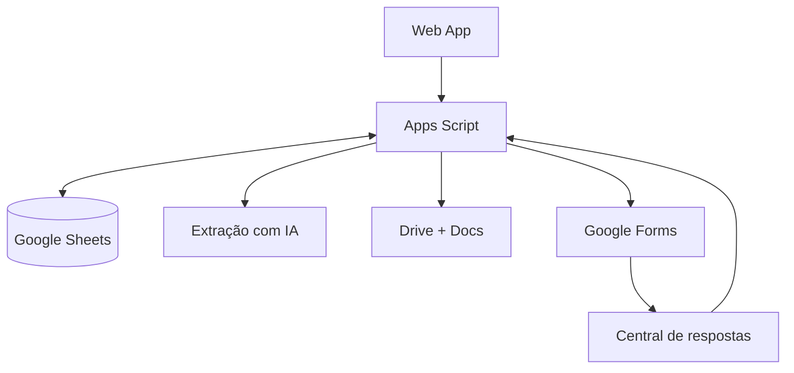

<div align="center">



# A&B Produção

[](https://github.com/GPTrioTech/AB-producao/actions/workflows/validate.yml)
**Do contrato à operação, com revisão humana em cada decisão.**

Sistema do Grupo TRIO para organizar o fluxo de Alimentos & Bebidas dos eventos: contratos, degustação, escolhas do cliente, Menu Final e Ordem de Serviço.

[Conheça o fluxo](meu-software/docs/GUIA_OPERACAO.md) · [Documentação](meu-software/docs/README.md) · [Implantação](meu-software/docs/GUIA_IMPLANTACAO.md) · [Pendências](meu-software/docs/PENDENCIAS.md)

</div>

---

## O que o projeto faz

O A&B Produção transforma informações contratuais em um fluxo estruturado de trabalho. A Produção revisa os dados extraídos, acompanha as escolhas do cliente e aprova a geração dos documentos finais.

| Etapa | Entrega |
|---|---|
| Contrato e aditivos | Dados do evento e cardápio vigente extraídos com apoio de IA |
| Revisão da Produção | Cabeçalho e menu conferidos antes de seguir |
| Escolhas do cliente | Escolha de Menu em DOC/PDF e formulário de degustação |
| Pós-degustação | Relatório e formulário interno com definições operacionais |
| Aprovação final | Menu Final e OS A&B em DOC/PDF |
| Alterações posteriores | Análise de aditivos e reabertura das etapas afetadas |

## Como funciona



**A geração final depende de uma ação explícita da Produção.** Responder o Form Interno registra as escolhas, mas não emite automaticamente o Menu Final e a OS.

## Para quem

| Público | Papel |
|---|---|
| Produção | Opera o Web App, revisa informações e aprova a geração |
| Cliente | Informa escolhas de menu e observações no formulário |
| Cozinha, Salão, Maitria e Compras A&B | Consultam as informações consolidadas para a operação |
| Comercial | Fornece contrato e informações da passagem de bastão |
| TRIO Tech | Mantém o código, as integrações e a documentação |

## Comece por aqui

| Sua tarefa | Referência |
|---|---|
| Entender o uso no dia a dia | [Guia de operação](meu-software/docs/GUIA_OPERACAO.md) |
| Encontrar um documento técnico | [Índice da documentação](meu-software/docs/README.md) |
| Preparar ou atualizar o ambiente | [Guia de implantação e validação](meu-software/docs/GUIA_IMPLANTACAO.md) |
| Alterar o código | [Como contribuir](CONTRIBUTING.md) e [instruções de desenvolvimento](meu-software/AGENTS.md) |
| Investigar um problema | [Bugs e limitações](meu-software/docs/BUGS_E_LIMITACOES.md) |
| Priorizar melhorias | [Pendências e critérios de aceite](meu-software/docs/PENDENCIAS.md) |

## Arquitetura

A interface é servida por **Google Apps Script**. O **Google Sheets** mantém o estado operacional; **Drive, Docs e Forms** armazenam arquivos, geram documentos e coletam respostas. A **OpenAI Responses API** auxilia a extração e a consolidação contratual.



[Arquitetura detalhada](meu-software/docs/ARQUITETURA.md) · [Integrações](meu-software/docs/INTEGRACOES.md) · [Estrutura de dados](meu-software/docs/BANCO_DADOS.md)

## Estado do projeto

[Configuração do repositório](docs/CONFIGURACAO_REPOSITORIO.md) · [Suporte](SUPPORT.md) · [Relato de vulnerabilidades](SECURITY.md)

Este repositório contém um **snapshot de código e documentação de transição**. A versão efetivamente implantada na conta Google ainda precisa ser conferida.

| Componente | Baseline documentada |
|---|---|
| Motor de negócio | Backend V23.1 |
| Controller do Web App | V23.2 |
| Interface HTML | V23.2 |
| Utilitário de reset de testes | Anterior à V23.2 |

Essa combinação de versões é intencional. Não representa erro de versionamento. Os próximos marcos são comparar o snapshot com o ambiente ativo, validar o fluxo completo com evento controlado e tratar os riscos priorizados de aditivos e concorrência.

**Esta revisão melhora a documentação; não altera o aplicativo nem sua implantação.**

## Estrutura

```text
AB-producao/
├── README.md                 # Apresentação do projeto
├── CONTRIBUTING.md           # Orientação para alterações
├── docs/                     # Recursos visuais da apresentação
└── meu-software/
    ├── AGENTS.md             # Regras de desenvolvimento
    ├── README.md             # Referência técnica e configuração
    ├── SOURCE_SNAPSHOT.md    # Procedência do código
    ├── backend/              # Regras de negócio e integrações
    ├── frontend/             # Controller e interface do Web App
    ├── scripts/              # Utilitário administrativo de testes
    ├── database/             # Referência da persistência em Sheets
    └── docs/                 # Guias, arquitetura, fluxos e pendências
```

## Princípios do fluxo

- Revisão humana antes de enviar escolhas e emitir documentos finais.
- Operação por `ID_EVENTO`, sem depender da linha selecionada na planilha.
- Bar de Drinks fora do escopo; bebidas do Anexo II seguem as regras próprias.
- Aditivos analisados antes da aplicação e tratados conforme a etapa do evento.
- Menu Final voltado ao cliente; detalhes operacionais concentrados na OS.

Consulte as [regras de negócio](meu-software/docs/REGRAS_NEGOCIO.md) antes de alterar esses comportamentos.

---

**TRIO Tech · Grupo TRIO**  
[Tecnologia](https://github.com/GPTrioTech) · [Site institucional](https://www.grupotrio.com.br/)
