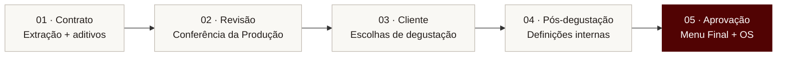

<div align="center">


**Gestão de Alimentos & Bebidas · Grupo TRIO**

Contratos, degustação e documentos operacionais em um fluxo acompanhado pela Produção.

[](https://github.com/GPTrioTech/AB-producao/actions/workflows/validate.yml)

[**Guia de operação**](meu-software/docs/GUIA_OPERACAO.md) &nbsp; · &nbsp; [**Documentação**](meu-software/docs/README.md) &nbsp; · &nbsp; [**Implantação**](meu-software/docs/GUIA_IMPLANTACAO.md) &nbsp; · &nbsp; [**Suporte**](SUPPORT.md)

</div>

---

## Uma operação, do início ao fim

O **A&B Produção** organiza as informações do contrato, acompanha as escolhas do cliente e prepara os documentos usados na execução do evento. A equipe confere os dados e conduz cada avanço do processo.

<table>
<tr>
<td width="33%" valign="top">

### 01 · Organizar
Contrato e aditivos consolidados, com extração assistida por IA e revisão do cabeçalho e do cardápio.

</td>
<td width="33%" valign="top">

### 02 · Acompanhar
Escolhas do cliente, relatório de degustação e definições internas reunidos no fluxo do evento.

</td>
<td width="33%" valign="top">

### 03 · Entregar
Menu Final e Ordem de Serviço em DOC/PDF, gerados após a aprovação explícita da Produção.

</td>
</tr>
</table>

## O caminho de cada evento



> **A decisão final é da Produção.** A resposta ao Form Interno registra as escolhas; o Menu Final e a OS são emitidos somente após o comando explícito de geração.

## Acesso rápido

| Para quem opera | Para quem mantém |
| :--- | :--- |
| [**Guia de operação**](meu-software/docs/GUIA_OPERACAO.md)<br>Rotina e etapas do evento | [**Implantação e validação**](meu-software/docs/GUIA_IMPLANTACAO.md)<br>Preparação e atualização do ambiente |
| [**Regras de negócio**](meu-software/docs/REGRAS_NEGOCIO.md)<br>Critérios de menu, degustação e aditivos | [**Arquitetura e integrações**](meu-software/docs/ARQUITETURA.md)<br>Componentes e comunicação entre serviços |
| [**Suporte**](SUPPORT.md)<br>Como relatar erros e solicitar melhorias | [**Como contribuir**](CONTRIBUTING.md)<br>Orientações para mudanças no projeto |

[Ver toda a documentação →](meu-software/docs/README.md)

## Entregas do sistema

| Momento | Documento | Uso |
| :--- | :--- | :--- |
| Antes da degustação | **Escolha de Menu** + Form Cliente | Coletar escolhas e observações |
| Após a resposta do cliente | **Relatório de Degustação** + Form Interno | Preparar a conferência operacional |
| Após a aprovação da Produção | **Menu Final** | Apresentar o cardápio ao cliente |
| Após a aprovação da Produção | **OS A&B** | Orientar Cozinha, Salão, Maitria e Compras A&B |

Os quatro documentos são gerados em **DOC e PDF**. Aditivos passam por análise antes da aplicação e podem reabrir as etapas afetadas, preservando referências dos artefatos anteriores.

## Tecnologia a serviço da operação

**Apps Script** serve a interface e executa as automações. **Google Sheets** mantém os registros; **Drive e Docs** organizam os arquivos e documentos; **Forms** coleta as respostas. A **OpenAI Responses API** auxilia a leitura e consolidação contratual.

[Arquitetura](meu-software/docs/ARQUITETURA.md) · [Integrações](meu-software/docs/INTEGRACOES.md) · [Estrutura de dados](meu-software/docs/BANCO_DADOS.md)

<details>
<summary><strong>Explorar a estrutura do repositório</strong></summary>

```text
AB-producao/
├── .github/                  Validação e modelos de colaboração
├── docs/                     Apresentação e configuração do repositório
├── tools/                    Verificação local
└── meu-software/
    ├── AGENTS.md             Regras de desenvolvimento
    ├── SOURCE_SNAPSHOT.md    Procedência do código
    ├── backend/              Regras de negócio e integrações
    ├── frontend/             Controller e interface do Web App
    ├── scripts/              Utilitário administrativo de testes
    ├── database/             Referência da persistência em Sheets
    └── docs/                 Guias, fluxos e pendências
```

Leia as [instruções de desenvolvimento](meu-software/AGENTS.md) antes de alterar o código.

</details>

<details>
<summary><strong>Consultar os princípios do fluxo</strong></summary>

- Revisão humana antes de enviar escolhas e emitir documentos finais.
- Operação por `ID_EVENTO`, sem depender da linha ativa da planilha.
- Bar de Drinks fora do escopo; bebidas do Anexo II seguem regras próprias.
- Aditivos analisados antes da aplicação, conforme a etapa do evento.
- Menu Final voltado ao cliente; detalhes operacionais concentrados na OS.
- Comercial fornece contrato e passagem de bastão; TRIO Tech mantém código e integrações.

</details>

## Estado e próximos passos

> **Baseline documentada · implantação a conferir**<br>
> Este repositório reúne um snapshot de código e documentação de transição. A versão ativa na conta Google ainda precisa ser comparada com este material.

| Componente | Versão de referência |
| :--- | :--- |
| Backend | **V23.1** |
| Controller e interface | **V23.2** |
| Utilitário de reset de testes | Anterior à V23.2 |

A combinação de versões é intencional. Os próximos passos são conferir o ambiente ativo, executar o fluxo completo com evento controlado e tratar os riscos priorizados de aditivos e concorrência.

[**Pendências**](meu-software/docs/PENDENCIAS.md) · [**Bugs e limitações**](meu-software/docs/BUGS_E_LIMITACOES.md) · [**Configuração do repositório**](docs/CONFIGURACAO_REPOSITORIO.md)

---

<div align="center">

**TRIO Tech · Grupo TRIO**<br>
Tecnologia para apoiar quem organiza e realiza cada encontro.

[Grupo TRIO](https://www.grupotrio.com.br/) · [Time de tecnologia](https://github.com/GPTrioTech) · [Contribuição](CONTRIBUTING.md) · [Segurança](SECURITY.md)

</div>
