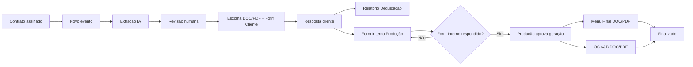
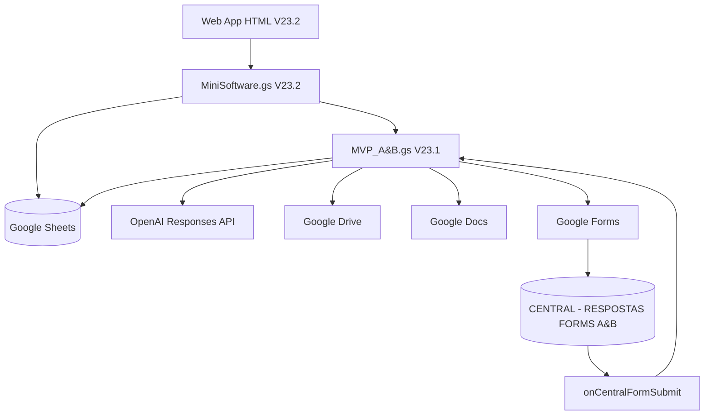

# Mini Software A&B

[Apresentação do projeto](../README.md) · [Índice da documentação](docs/README.md) · [Guia de operação](docs/GUIA_OPERACAO.md) · [Guia de implantação](docs/GUIA_IMPLANTACAO.md)

Esta página mantém a referência técnica do snapshot. Para uma visão rápida do produto e dos caminhos de consulta, comece pela apresentação na raiz do repositório.

## Visão geral

O **Mini Software A&B** é um Web App interno que automatiza o fluxo documental e operacional de Gastronomia/Alimentos & Bebidas de eventos.

Foi criado para substituir um processo com alta dependência de leitura manual de contratos, preenchimento de documentos, coleta de escolhas por mensagens/fotos e repetição de informações entre Comercial, Produção, cliente, Cozinha, Compras A&B e Maitria/Salão.

A solução atual usa uma planilha Google como banco, Apps Script como backend/orquestrador, Google Forms para coleta estruturada, Google Docs para documentos e OpenAI para extração/consolidação contratual.

## Usuários

- **Produção**: principal usuária operacional do Web App.
- **Cliente**: responde o Formulário de Escolha de Menu.
- **Cozinha / Salão / Maitria / Compras A&B**: consumidores das informações consolidadas no Relatório/OS.
- **Comercial**: origem do contrato e da passagem de bastão.

## Problema resolvido

Antes da automação, a escolha do cliente podia chegar por papel, foto, WhatsApp ou texto solto. A Produção precisava reler contrato, transcrever cardápio, validar quantidades, gerar documentos e repetir informação em vários artefatos.

O sistema transforma o contrato em uma estrutura auditável, força revisão humana e propaga o estado validado para os documentos seguintes.

## Principais funcionalidades

- criação de eventos;
- extração de contrato com IA;
- suporte a múltiplos aditivos contratuais;
- revisão do cabeçalho e do Anexo II dentro do Web App;
- geração de Escolha de Menu DOC/PDF;
- geração de Form Cliente com checkboxes e validações;
- Relatório de Degustação;
- Form Interno de Produção pós-degustação;
- pré-seleção das escolhas degustadas;
- configuração de serviço por categoria gastronômica;
- Camarim e Staff com lógica condicional;
- geração de Menu Final e OS A&B;
- atualização de PDF depois de editar o DOC;
- histórico/log técnico;
- workflow de aditivos em três momentos do evento;
- retentativa segura de falhas técnicas;
- indicador de progresso e ETA;
- frontend full-screen com lazy loading e auto-sync.

## Fluxo principal



## Stack

- Google Apps Script
- Google Sheets
- Google Drive
- Google Docs
- Google Forms
- Apps Script HTML Service / Web App
- OpenAI Responses API

## Arquitetura resumida



## Estrutura do repositório de handoff

```text
meu-software/
├── AGENTS.md
├── README.md
├── backend/
│   └── MVP_A&B.gs
├── frontend/
│   ├── MiniSoftware.gs
│   └── MVP_AB_App.html
├── scripts/
│   └── Reset_Producao.gs
├── database/
│   └── README.md
└── docs/
    ├── CONTEXTO_PROJETO.md
    ├── REGRAS_NEGOCIO.md
    ├── ARQUITETURA.md
    ├── FLUXOS.md
    ├── BANCO_DADOS.md
    ├── INTEGRACOES.md
    ├── BUGS_E_LIMITACOES.md
    ├── DECISOES_TECNICAS.md
    ├── PENDENCIAS.md
    └── CHANGELOG.md
```

## Baseline de código

- Backend: `MVP_A&B.gs` V23.1.
- Controller/API Web App: `MiniSoftware.gs` V23.2.
- HTML: `MVP_AB_App.html` V23.2.
- Reset: versão anterior à V23.2.

`[PRECISA VALIDAR — implantação real na conta Google de produção não foi confirmada na conversa após a geração da V23.2.]`

## Configuração / execução

### Script Properties obrigatórias

- `OPENAI_API_KEY`
- `OPENAI_MODEL`
- `TEMPLATE_ESCOLHA_ID`
- `TEMPLATE_RELATORIO_ID`
- `TEMPLATE_MENU_FINAL_ID`
- `TEMPLATE_OS_ID`

Infraestrutura criada/armazenada automaticamente:

- `CENTRAL_RESPOSTAS_ID`
- `PAINEL_SPREADSHEET_ID`
- `METRICAS_TEMPO_AB` (métricas de ETA, quando usado)

### Preparação inicial

No menu da planilha:

1. `MVP A&B > 0. Preparar estrutura`
2. `MVP A&B > 0B. Preparar produção escalável`
3. Autorizar serviços na conta de produção.
4. `MVP A&B > Diagnosticar arquitetura de Forms`
5. `MVP A&B > Testar configurações`

### Web App

O projeto precisa estar implantado como **Aplicativo da Web**. `doGet()` serve o arquivo HTML `MVP_AB_App`.

Em atualizações:

1. salvar o Apps Script;
2. `Implantar > Gerenciar implantações`;
3. editar a implantação existente;
4. selecionar/criar nova versão;
5. implantar;
6. preservar a URL `/exec`.

Configuração exata de “Executar como” e “Quem pode acessar” no ambiente real: `[PRECISA VALIDAR]`.

## Arquivos/templates externos importantes

Foram usados quatro modelos no Drive:

- `MODELO - ESCOLHA MENU DEGUSTAÇÃO`
- `MODELO - RELATÓRIO DE DEGUSTAÇÃO`
- `MODELO - MENU FINAL`
- `MODELO - OS A&B`

Os IDs ficam nas Script Properties. A versão exata atualmente implantada dos templates precisa ser validada.

## Referências funcionais usadas no desenvolvimento

Casos reais/teste recorrentes na conversa:

- contrato `260410` — Aniversário Valentina 18 anos — SKY;
- contrato `260411` — Casamento Raquel e João — T19, com múltiplos aditivos;
- casos Scania e Berkley foram usados para encontrar bugs de bebidas, opções duplicadas e categorias divididas.

## Leia antes de desenvolver

Comece por `AGENTS.md`. Depois use os documentos de `/docs` conforme o tipo de alteração.


# ARQUIVOS DE CÓDIGO IDENTIFICADOS

## `/backend`

### `MVP_A&B.gs`
- Origem: `MVP A&B_V23_1.gs` gerado na conversa a partir dos arquivos ativos enviados pelo usuário.
- Versão: Backend consolidado **V23.1**.
- Estado: **código completo** no material disponível.
- Observação: incorpora arquitetura V21/V21.1/V21.2 e alterações de negócio até V23.1.

## `/frontend`

### `MiniSoftware.gs`
- Origem: `MiniSoftware_V23_2.gs`.
- Versão: **V23.2**.
- Estado: **código completo**.
- Função: APIs/controller do Web App, performance, progresso, PDF e aditivos.

### `MVP_AB_App.html`
- Origem: `MVP_AB_App_V23_2.html`.
- Versão: **V23.2**.
- Estado: **código completo**.
- Função: interface do Web App.

## `/database`

Não há arquivo de banco separado. O schema existe nas constantes do backend e na criação automática de `ADITIVO_WORKFLOW`. Veja `database/README.md` e `docs/BANCO_DADOS.md`.

## `/scripts`

### `Reset_Producao.gs`
- Origem: `Reset_Producao_AB.gs`.
- Versão: criada no período V21/V22, anterior à V23.2.
- Estado: **código completo do artefato gerado**, porém `[PRECISA VALIDAR]` se é byte-a-byte igual ao arquivo atualmente ativo na conta de produção.
- Limitação: não limpa `ADITIVO_WORKFLOW`.

## Código histórico disponível na conversa

Também foram produzidas versões `Code_v2` até `Code_v21`, hotfixes V21.1/V21.2, fronts V22/V22.1/V22.2/V22.3 e V23. Esses arquivos são **histórico**, não devem substituir a baseline atual.

Como este pacote inclui snapshots completos dos arquivos mais recentes identificados, o Codex pode iniciar a análise do código imediatamente. Ainda assim, **antes de alterar produção deve comparar esses snapshots com os arquivos realmente implantados no Apps Script**, porque a conversa não confirma a publicação final da V23.2.
