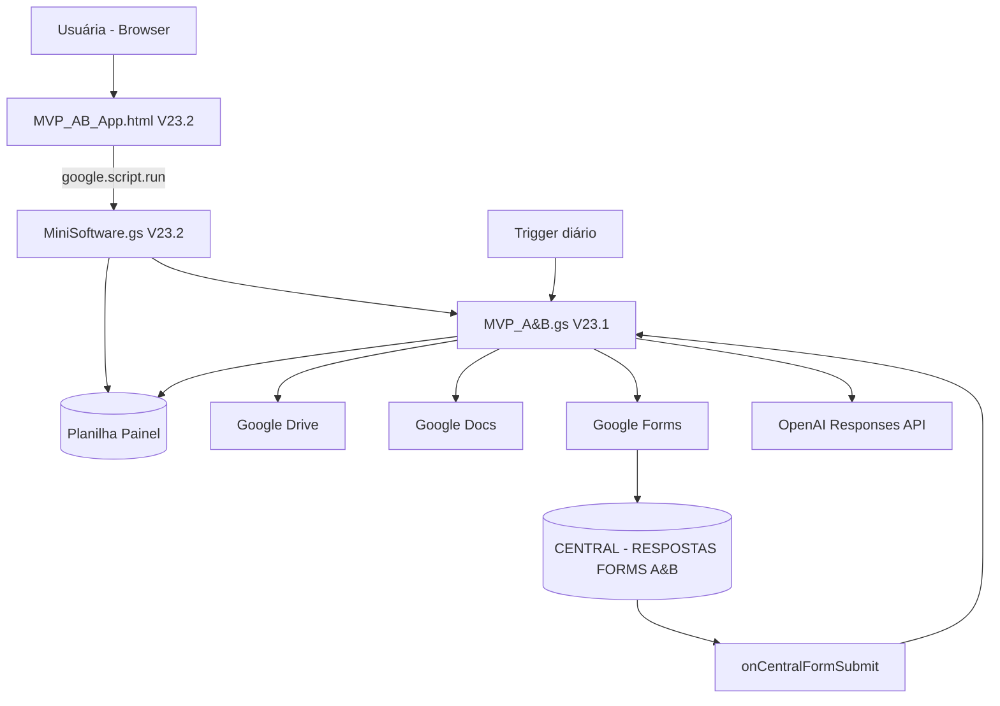
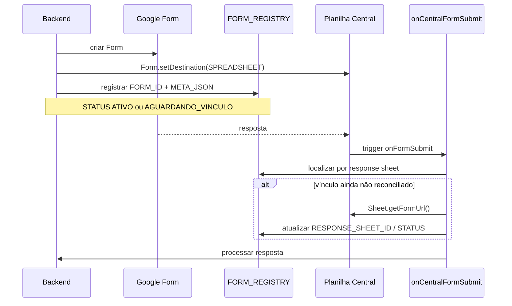
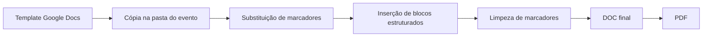
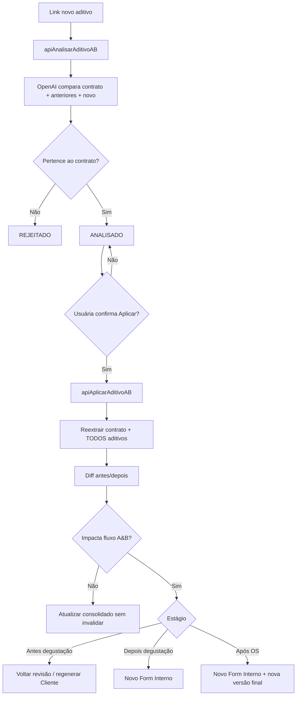

# ARQUITETURA.md

## 1. Visão geral

O sistema é um **monólito Apps Script** distribuído em arquivos lógicos, com Google Sheets como persistência e um Web App HTML como interface.

Embora existam arquivos “frontend” e “backend”, todos os `.gs` vivem no mesmo namespace global do projeto Apps Script. Uma função definida duas vezes em arquivos distintos pode conflitar.

## 2. Frontend

### HTML
Arquivo: `frontend/MVP_AB_App.html`.

Responsabilidades:

- renderização da lista lateral;
- filtros e pesquisa;
- workspace do evento;
- stepper de status;
- abas `Visão geral`, `Revisão da extração`, `Arquivos`, `Erros & histórico`, `Aditivos`;
- modal de novo evento;
- tela de processamento;
- feedback/Toast;
- auto-sync;
- cache no cliente para dados lazy já carregados.

A comunicação é feita por `google.script.run` para funções server-side de `MiniSoftware.gs`.

### Performance / lazy loading V23.2

Ao selecionar evento:

1. renderiza imediatamente dados já existentes na sidebar;
2. chama `apiObterEventoShellAB()` para estado leve;
3. só carrega revisão ao abrir a tab;
4. só carrega LOG ao abrir histórico;
5. só carrega aditivos ao abrir a tab correspondente;
6. estado do Form Interno vem principalmente do `FORM_REGISTRY`, evitando `FormApp.openById()` na navegação.

Auto-sync:

- evento aberto: endpoint leve em intervalo de ~10s;
- sidebar: atualização aproximadamente a cada 30s.

## 3. Controller/API do Web App

Arquivo: `frontend/MiniSoftware.gs` V23.2.

### Funções de entrada principais

- `doGet()`
- `abrirMiniSoftwareAB()`
- `apiHealthcheckFrontAB()`
- `apiPainelInicialAB()`
- `apiResumoPainelAB()`
- `apiListarEventosPainelAB()`
- `apiCriarEventoAB()`
- `apiBuscarEventoDetalheAB()`
- `apiObterEventoShellAB()`
- `apiObterEstadoLeveEventoAB()`
- `apiObterRevisaoExtracaoAB()`
- `apiSalvarRevisaoExtracaoAB()`
- `apiObterHistoricoEventoAB()`
- `apiAtualizarPdfDocumentoAB()`
- `apiExecutarAcaoAB()`
- `apiObterProgressoAB()`
- `apiObterAditivosEventoAB()`
- `apiAnalisarAditivoAB()`
- `apiAplicarAditivoAB()`

### Cache

Constantes V23.2:

- `AB_V232_EVENT_LIST`
- `AB_V232_EVENT_ROW_<ID>`
- `AB_V232_FORM_STATE_<...>`
- `AB_PROGRESS_<token>`

`CacheService` é otimização, não fonte de verdade.

### Locks

Ações de usuário usam predominantemente `LockService.getUserLock()`.

**Consequência:** o lock serializa ações do mesmo usuário, não necessariamente de dois usuários diferentes atuando no mesmo evento. Ver `BUGS_E_LIMITACOES.md`.

## 4. Backend de negócio

Arquivo: `backend/MVP_A&B.gs` V23.1.

### Domínios internos

#### Setup / infraestrutura
- `prepararEstrutura()`
- `prepararProducaoEscalavel()`
- `garantirInfraFormsEscalavel()`
- `diagnosticarArquiteturaForms()`
- `testarConfiguracoes()`

#### Extração
- `obterPdfContrato()`
- `obterAditivosComoPdf()`
- `extrairContratoComIA()`
- `normalizarExtracao()`

#### Dados
- `gravarMenu()`
- `gravarTerceiros()`
- `gravarAditivosAplicados()`
- `carregarDadosEvento()`
- agrupadores/normalizadores

#### Cliente
- `gerarDocumentoEscolha()`
- `criarFormularioCliente()`
- `processarRespostaCliente()`

#### Forms escaláveis
- `registrarFormularioEscalavel()`
- `localizarAbaRespostaDoFormulario_()`
- `onCentralFormSubmit()`
- `obterMetaFormulario()`
- `limparFormsEscalaveisExpirados()`
- `marcarFormularioInternoProcessado()`
- legado: `onAnyFormSubmit()`

#### Pós-degustação
- `criarFormularioInterno()`
- `registrarRespostaInternaParaAprovacao_()`
- `processarRespostaInterna()`
- `resolverCategoriasMenuFinal()`
- `resolverServicosCategorias()`
- `complementarParsedComRespostasSalvas()`

#### Documentos
- `gerarDocumento()`
- `prepararMarcadoresOpcionais()`
- `inserirBlocoEstruturado()`
- `removerParagrafoMarcadorSeguro_()`
- `validarModelosFinais()`

#### Diagnóstico / recuperação
- `diagnosticarFormularioInternoLinhaAtiva()`
- `gerarMenuFinalEOsUltimaRespostaLinhaAtiva()`
- `recriarFormularioInternoUltimaRespostaClienteLinhaAtiva()`

As funções “LinhaAtiva” permanecem como ferramentas administrativas/legadas; o Web App não deve depender delas.

## 5. Persistência

A planilha painel contém:

- `EVENTOS`
- `MENU_ANEXO_II`
- `TERCEIROS_REGISTRO`
- `RESPOSTAS`
- `ADITIVOS_APLICADOS`
- `FORM_REGISTRY`
- `LOG`
- `ADITIVO_WORKFLOW` (V23.2, criada pelo controller quando necessário)

Uma segunda planilha técnica, `CENTRAL - RESPOSTAS FORMS A&B`, recebe as abas de resposta dos Forms ativos.

Schema completo: `BANCO_DADOS.md`.

## 6. Arquitetura dos Forms

### Cliente
Primeira resposta -> Relatório + Form Interno -> Form Cliente fechado -> registry aguardando limpeza imediata.

### Interno
Resposta -> gravada -> `RESPONDIDO_AGUARDANDO_GERACAO`. Só depois do clique final o registry vira `PROCESSADO` e recebe `EXPIRA_EM = +14 dias`.

## 7. Geração de documentos

Templates são Google Docs identificados por Script Properties.

Pipeline:

Em falha durante `gerarDocumento()`, a cópia incompleta deve ser enviada à lixeira.

## 8. Integração OpenAI

`extrairContratoComIA()` chama `https://api.openai.com/v1/responses` com:

- Bearer `OPENAI_API_KEY`;
- modelo de `OPENAI_MODEL`;
- PDFs base64;
- instrução/prompt de domínio;
- retorno forçado por JSON Schema.

A análise de aditivo V23.2 também usa a Responses API, mas com schema específico de comparação do novo aditivo.

## 9. Workflow de aditivo

A lógica V23.2 reside hoje no **controller** `MiniSoftware.gs`, não no backend V23.1. Isso é arquitetura real, embora concentre regra de negócio na camada de Web App.

## 10. Deployment/autenticação

O Web App é uma implantação Apps Script. `doGet()` retorna `HtmlService.createHtmlOutputFromFile('MVP_AB_App')`.

Configuração final de acesso no ambiente real: `[PRECISA VALIDAR]`.

Triggers instaláveis pertencem ao usuário que os criou. Após mudança de conta/proprietário, é obrigatório validar que os triggers centrais pertencem à conta de produção.

## 11. Ausência de infraestrutura tradicional

Não foram identificados:

- servidor Node/Python dedicado;
- banco SQL;
- Docker;
- CI/CD;
- testes automatizados unitários;
- Git/repositório original conectado;
- framework frontend externo.

`[NÃO IDENTIFICADO NA CONVERSA]` se qualquer um desses componentes existir fora do material fornecido.

## Apêndice A — funções identificadas no backend V23.1

- `onOpen()`
- `prepararEstrutura()`
- `prepararProducaoEscalavel()`
- `garantirInfraFormsEscalavel()`
- `obterPlanilhaPainel()`
- `moverArquivoParaPastaDoPainel()`
- `garantirGatilhoCentralForms()`
- `garantirGatilhoLimpezaForms()`
- `diagnosticarArquiteturaForms()`
- `criarOuAtualizarAba()`
- `testarConfiguracoes()`
- `extrairContratoLinhaAtiva()`
- `gerarEscolhaEFormularioLinhaAtiva()`
- `obterContextoLinhaAtiva()`
- `validarCamposIniciais()`
- `obterPdfContrato()`
- `obterAditivosComoPdf()`
- `extrairLinksGoogleMultiplos()`
- `extrairContratoComIA()`
- `obterOutputText()`
- `normalizarExtracao()`
- `ehBebidaOuFinalizacaoFixa()`
- `ehServicoContratadoOpcional()`
- `saoSomenteBebidasFixas()`
- `normalizarTituloServicoContratado()`
- `calcularQuantidadeMaximaDegustacao()`
- `obterRegraInterna()`
- `gravarMenu()`
- `gravarTerceiros()`
- `gravarAditivosAplicados()`
- `limparDadosEvento()`
- `removerLinhasPorId()`
- `carregarDadosEvento()`
- `lerLinhasPorEvento()`
- `agruparCardapioCompleto()`
- `agruparMenu()`
- `ehCategoriaNaoDegustada()`
- `montarCategoriasNaoDegustadas()`
- `montarSecoesNaoDegustadas()`
- `montarTextoNaoDegustados()`
- `agruparTerceiros()`
- `validarDadosAntesDoFormulario()`
- `gerarDocumentoEscolha()`
- `criarFormularioCliente()`
- `registrarFormularioEscalavel()`
- `localizarAbaRespostaDoFormulario_()`
- `onCentralFormSubmit()`
- `onAnyFormSubmit()`
- `registrarRespostaInternaParaAprovacao_()`
- `processarRespostaCliente()`
- `criarFormularioInterno()`
- `adicionarFluxoCamarimStaff()`
- `adicionarBlocoStaffPadrao()`
- `formatarCamarim()`
- `formatarStaffPadrao()`
- `formatarContratacaoStaffCliente()`
- `adicionarConfiguracaoServicoCategoria()`
- `adicionarCampoInterno()`
- `categoriaPermiteConfiguracaoOperacional_()`
- `criarUrlPreenchidoFormularioInterno_()`
- `obterDataPadraoCampoInterno_()`
- `extrairDataOperacao_()`
- `normalizarRespostaFormulario_()`
- `recriarFormularioInternoUltimaRespostaClienteLinhaAtiva()`
- `gerarMenuFinalEOsUltimaRespostaLinhaAtiva()`
- `diagnosticarFormularioInternoLinhaAtiva()`
- `montarDiagnosticoFormularioInterno()`
- `validarFormularioInternoDoEvento()`
- `validarModelosFinais()`
- `validarModeloFinalIndividual()`
- `processarRespostaInterna()`
- `lerRespostaFormulario()`
- `complementarParsedComRespostasSalvas()`
- `obterUltimoLoteRespostasInternas()`
- `mapearPerguntaServicoCategoria()`
- `encontrarChaveCardapioPorNome()`
- `mapearPerguntaParaCampoInterno()`
- `mapearPerguntaParaCategoriaExtra()`
- `encontrarChaveCategoriaPorNome()`
- `gravarRespostas()`
- `montarSecoesSelecionadas()`
- `limparTituloCategoria()`
- `montarTituloCategoria()`
- `montarRegraDegustacao()`
- `separarItensCampoLivre()`
- `resolverServicosCategorias()`
- `normalizarModoServico()`
- `formatarServicoCategoria()`
- `adicionarServicosNasSecoes()`
- `resumirTiposServico()`
- `resolverCategoriasMenuFinal()`
- `consolidarObservacoesCozinha()`
- `mesclarAvisos()`
- `combinarCategoriasComExtras()`
- `validarQuantidadesMenuFinal()`
- `formatarQuantidade()`
- `montarReplacementsBasicos()`
- `montarBlocoComplementarOs()`
- `montarBlocoObservacoesOs()`
- `formatarAlimentacaoStaff()`
- `montarResumoAditivos()`
- `gerarDocumento()`
- `prepararMarcadoresOpcionais()`
- `inserirMarcadorNaoDegustados()`
- `inserirMarcadorServicosContratados()`
- `elementoEstaEmParagrafoDoCorpo()`
- `inserirBlocoEstruturado()`
- `removerParagrafoMarcadorSeguro_()`
- `removerMarcadoresRestantes()`
- `salvarRegistroFormulario()`
- `obterAbaFormRegistry()`
- `lerRegistrosForms()`
- `buscarRegistroFormulario()`
- `buscarRegistroFormPorResponseSheetId()`
- `atualizarRegistroFormulario()`
- `obterMetaFormulario()`
- `salvarMetaFormulario()`
- `criarGatilhoFormulario()`
- `parseJsonArray()`
- `adicionarDias()`
- `arquivarFormularioEscalavel()`
- `limparFormsEscalaveisExpirados()`
- `marcarFormularioInternoProcessado()`
- `limparFormMetaLegadosConcluidos()`
- `buscarEvento()`
- `atualizarEventoPorId()`
- `atualizarEvento()`
- `registrarLog()`
- `executarComTratamento()`
- `extrairIdGoogle()`
- `gerarIdEvento()`
- `removerDuplicidadesMenu()`
- `removerDuplicidadesTexto()`
- `normalizarChaveAgrupamento()`
- `normalizarTextoComparacao()`
- `normalizarChave()`
- `removerAcentos()`
- `escaparRegex()`
- `escaparReplacement()`
- `nomeSeguro()`
- `texto()`

## Apêndice B — funções identificadas no MiniSoftware V23.2

- `doGet()`
- `abrirMiniSoftwareAB()`
- `apiHealthcheckFrontAB()`
- `apiPainelInicialAB()`
- `apiResumoPainelAB()`
- `apiListarEventosPainelAB()`
- `apiListarResponsaveisAB()`
- `apiListarStatusAB()`
- `apiCriarEventoAB()`
- `apiBuscarEventoDetalheAB()`
- `apiObterWorkspaceEventoAB()`
- `apiObterEventoShellAB()`
- `apiObterEstadoLeveEventoAB()`
- `obterEstadoFormularioInternoAB_()`
- `apiAtualizarPdfDocumentoAB()`
- `obterConfigDocumentoPdfAB_()`
- `atualizarConteudoArquivoPdfAB_()`
- `gerarLinkLinhaEventoAB_()`
- `apiObterRevisaoExtracaoAB()`
- `apiSalvarRevisaoExtracaoAB()`
- `apiObterHistoricoEventoAB()`
- `determinarProximaAcaoAB_()`
- `determinarAcaoRetentativaAB_()`
- `apiObterProgressoAB()`
- `setProgressoAB_()`
- `obterEstimativasTempoAB_()`
- `registrarDuracaoAcaoAB_()`
- `apiExecutarAcaoAB()`
- `executarAcaoDiretaAB_()`
- `executarExtracaoPorIdAB_()`
- `gerarEscolhaFormPorIdAB_()`
- `reprocessarClientePorIdAB_()`
- `recriarFormInternoPorIdAB_()`
- `gerarFinalOsPorIdAB_()`
- `ehErroTecnicoRetentavelAB_()`
- `podeRetentarSemDuplicarAB_()`
- `invalidarCacheEventosAB_()`
- `buscarEventoRapidoAB_()`
- `lerEventoDaLinhaAB_()`
- `calcularResumoEventosAB_()`
- `filtrarEventosPainelAB_()`
- `listarResponsaveisDeEventosAB_()`
- `listarStatusDeEventosAB_()`
- `garantirInfraAditivosFrontAB_()`
- `apiObterAditivosEventoAB()`
- `obterResumoAditivoEventoAB_()`
- `lerWorkflowAditivosEventoAB_()`
- `buscarWorkflowAditivoAB_()`
- `atualizarWorkflowAditivoAB_()`
- `sugerirEstagioAditivoAB_()`
- `validarEstagioAditivoAB_()`
- `apiAnalisarAditivoAB()`
- `analisarNovoAditivoComIA_()`
- `montarPlanoPreliminarAditivoAB_()`
- `apiAplicarAditivoAB()`
- `validarEstagioContraEstadoAB_()`
- `capturarSnapshotContratualAB_()`
- `snapshotDeNormalizadoAB_()`
- `compararEstadosContratuaisAB_()`
- `indexarMenuDiffAB_()`
- `indexarTerceirosDiffAB_()`
- `normalizarChaveDiffAB_()`
- `capturarArtefatosEventoAB_()`
- `montarPlanoFinalAditivoAB_()`
- `aplicarPlanoFluxoAditivoAB_()`
- `arquivarFormularioAditivoSeguroAB_()`
- `deduplicarLinksAditivosAB_()`
- `rotuloEstagioAditivoAB_()`
- `lerEventosPainelAB_()`
- `mapearEventoFrontAB_()`
- `aplicarFiltrosFrontAB_()`
- `ordenarEventosFrontAB_()`
- `validarNovoEventoFrontAB_()`
- `gerarIdEventoFrontAB_()`
- `parseJsonSeguroFrontAB_()`
- `serializarObjetoFrontAB_()`
- `normalizarBooleanFrontAB_()`
- `formatarDataFront_()`
- `formatarDataHoraFront_()`
- `formatarDataInputFront_()`
- `converterStringParaDataFront_()`
- `normalizarDataFront_()`
