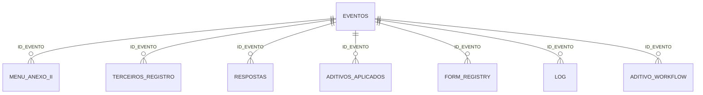

# BANCO_DADOS.md

## 1. Visão geral

Não existe banco relacional externo. A persistência é feita em **Google Sheets**.

Chave lógica principal: `ID_EVENTO`.



## 2. Aba `EVENTOS`

Fonte de verdade do estado atual do evento.

| # | Campo | Tipo lógico | Origem / uso |
|---:|---|---|---|
| 1 | `ID_EVENTO` | string | chave do evento; gerado `AB-yyyyMMdd-HHmmss` |
| 2 | `LINK_CONTRATO` | URL/string | entrada |
| 3 | `LINK_PASTA_EVENTO` | URL/string | entrada |
| 4 | `RESP_PRODUCAO` | string | entrada |
| 5 | `DATA_DEGUSTACAO` | date | entrada |
| 6 | `HORARIO_DEGUSTACAO` | string | entrada |
| 7 | `LOCAL_DEGUSTACAO` | string | entrada |
| 8 | `PAX_DEGUSTACAO` | number | entrada |
| 9 | `STATUS` | enum | máquina de estado |
| 10 | `LINK_ESCOLHA_DOC` | URL | geração |
| 11 | `LINK_ESCOLHA_PDF` | URL | geração |
| 12 | `LINK_FORM_CLIENTE` | URL | geração |
| 13 | `LINK_RELATORIO_DOC` | URL | resposta cliente |
| 14 | `LINK_RELATORIO_PDF` | URL | resposta cliente |
| 15 | `LINK_FORM_INTERNO` | URL | resposta cliente/recriação |
| 16 | `LINK_MENU_FINAL_DOC` | URL | geração final |
| 17 | `LINK_MENU_FINAL_PDF` | URL | geração final |
| 18 | `LINK_OS_DOC` | URL | geração final |
| 19 | `LINK_OS_PDF` | URL | geração final |
| 20 | `JSON_CABECALHO` | JSON string | extração consolidada |
| 21 | `JSON_FIXOS` | JSON string | extração/normalização |
| 22 | `AVISOS_REVISAO` | string multiline | warnings não bloqueantes |
| 23 | `ERRO` | string | último erro relevante |
| 24 | `PROCESSADO_EM` | datetime | extração/processamento |
| 25 | `FORM_CLIENTE_ID` | string | Google Form ID |
| 26 | `FORM_INTERNO_ID` | string | Google Form ID |
| 27 | `LINKS_ADITIVOS` | string multiline | links dos aditivos correntes |
| 28 | `JSON_ADITIVOS` | JSON string | consolidação de aditivos |
| 29 | `VALOR_ADITIVOS` | number | total adicional |
| 30 | `VALOR_TOTAL_CONSOLIDADO` | number | total final consolidado |

### Status permitidos pela validação da V23.1

- `NOVO`
- `PROCESSANDO_CONTRATO`
- `AGUARDANDO_REVISAO`
- `AGUARDANDO_CLIENTE`
- `RELATORIO_GERADO`
- `AGUARDANDO_POS_DEGUSTACAO`
- `MENU_FINAL_E_OS_GERADOS`
- `ERRO`

O frontend também contém referências a `ARQUIVADO` em filtros/compatibilidade, porém esse valor não aparece na validação atual de `EVENTOS`. `[PRECISA VALIDAR — se ARQUIVADO é estado intencional de EVENTOS ou resíduo de versões anteriores.]`

### Risco de ID

`ID_EVENTO` atual usa precisão de segundos e não inclui aleatoriedade. Dois usuários diferentes criando evento no mesmo segundo podem, teoricamente, gerar colisão. Ver pendências.

## 3. Aba `MENU_ANEXO_II`

| Campo | Tipo lógico | Uso |
|---|---|---|
| `ID_EVENTO` | string | FK lógica |
| `GRUPO` | string | menu/grupo principal |
| `CATEGORIA` | string | categoria |
| `ITEM` | string | prato/item |
| `QTD_DEGUSTACAO` | number | máximo/exato do Form Cliente |
| `QTD_MENU_FINAL` | number | quantidade final contratada |
| `TIPO` | enum | classificação |

### Enum `TIPO`

- `SELECIONAVEL`
- `INCLUSO_CARDAPIO`
- `FIXO`
- `SERVICO_CONTRATADO`

## 4. Aba `TERCEIROS_REGISTRO`

| Campo | Tipo |
|---|---|
| `ID_EVENTO` | string |
| `TIPO` | string |
| `CATEGORIA` | string |
| `ITEM` | string |
| `INCLUIR_MENU_FINAL` | boolean |
| `INCLUIR_OS` | boolean |

Uso: registrar itens de terceiros (ilhas/doces/estações etc.) sem misturá-los ao menu degustável.

## 5. Aba `RESPOSTAS`

| Campo | Tipo |
|---|---|
| `ID_EVENTO` | string |
| `TIPO_FORMULARIO` | `CLIENTE` ou `INTERNO` |
| `PERGUNTA` | string |
| `RESPOSTA` | string |
| `DATA_RESPOSTA` | datetime |

Funções:

- histórico operacional;
- fallback para dados de Forms internos antigos quando `META_JSON` não mapeava campos corretamente.

## 6. Aba `ADITIVOS_APLICADOS`

| Campo | Tipo |
|---|---|
| `ID_EVENTO` | string |
| `ORDEM` | number/string |
| `DATA_ADITIVO` | string |
| `ARQUIVO` | string |
| `REFERENCIA_CONTRATO` | string |
| `TIPO_ALTERACAO` | string |
| `EFEITO_MENU` | enum/string |
| `RESUMO` | string |
| `VALOR_ADICIONAL` | number |

`EFEITO_MENU` do schema OpenAI usa:

- `SEM_ALTERACAO`
- `SUBSTITUICAO_TOTAL`
- `ALTERACAO_PARCIAL`
- `INCLUSAO`
- `REMOCAO`

Essa aba representa o resultado consolidado dos aditivos, diferente de `ADITIVO_WORKFLOW`, que registra o processo de análise/aplicação do novo aditivo.

## 7. Aba `FORM_REGISTRY`

| Campo | Tipo / uso |
|---|---|
| `FORM_ID` | chave do Form |
| `ID_EVENTO` | FK lógica |
| `TIPO` | `CLIENTE` / `INTERNO` |
| `STATUS` | estado do Form no workflow |
| `LINK_FORM` | URL publicada |
| `CENTRAL_SPREADSHEET_ID` | ID da central |
| `RESPONSE_SHEET_ID` | ID da aba temporária |
| `RESPONSE_SHEET_NAME` | nome da aba temporária |
| `META_JSON` | mapa das perguntas/categorias/campos |
| `RESPOSTAS_PROCESSADAS_JSON` | array de response IDs processados |
| `CRIADO_EM` | datetime |
| `ULTIMO_PROCESSAMENTO_EM` | datetime |
| `EXPIRA_EM` | datetime/vazio |
| `ERRO` | string |

### Status identificados

- `ATIVO`
- `AGUARDANDO_VINCULO`
- `PROCESSADO`
- `RESPONDIDO_AGUARDANDO_GERACAO`
- `ARQUIVADO`
- `ERRO`
- `ERRO_ARQUIVAMENTO`

`[PRECISA VALIDAR — podem existir valores legados adicionais em registros antigos.]`

### Estrutura de `META_JSON`

Cliente/Interno incluem conforme versão:

- `type`
- `eventId`
- `questionMap`
- `customCategoryFields`
- `categoryObservationFields`
- `serviceModeFields`
- `serviceHoursFields`
- `servicePointsFields`
- `fields`

Forms antigos podem ter metadata menor; por isso existe fallback em `RESPOSTAS`.

## 8. Aba `LOG`

| Campo | Tipo |
|---|---|
| `DATA` | datetime |
| `NIVEL` | `INFO`, `AVISO`, `ERRO` (identificados) |
| `ID_EVENTO` | string |
| `ETAPA` | string |
| `MENSAGEM` | string |

É a trilha técnica. O frontend carrega sob demanda.

## 9. Aba `ADITIVO_WORKFLOW` — V23.2

Criada automaticamente por `garantirInfraAditivosFrontAB_()`.

| Campo | Uso |
|---|---|
| `ID_EVENTO` | FK lógica |
| `ID_ADITIVO` | ID de workflow |
| `LINK_ADITIVO` | URL informada |
| `FILE_ID` | Drive file ID |
| `ARQUIVO` | nome do arquivo |
| `ESTAGIO` | momento do aditivo |
| `STATUS` | estado do workflow |
| `ANALISE_JSON` | saída da análise isolada |
| `IMPACTO_JSON` | diff/plano depois da aplicação |
| `ARTEFATOS_ANTERIORES_JSON` | snapshot de links anteriores |
| `ACAO_FLUXO` | plano final aplicado |
| `CRIADO_EM` | datetime |
| `APLICADO_EM` | datetime |
| `ERRO` | erro do workflow |

### Enum `ESTAGIO`

- `ANTES_DEGUSTACAO`
- `DEPOIS_DEGUSTACAO`
- `APOS_OS`

### Status identificados

- `PROCESSANDO`
- `ANALISADO`
- `REJEITADO`
- `APLICADO`
- `ERRO`
- `ERRO_APLICACAO`

## 10. JSON de cabeçalho

Schema OpenAI atual:

```json
{
  "numero_contrato": "",
  "evento": "",
  "local": "",
  "contratante": "",
  "data_evento": "",
  "horario": "",
  "numero_convidados": 0,
  "montagem": "",
  "desmontagem": "",
  "data_limite_menu": "",
  "valor_servicos": "",
  "valor_alimentos_bebidas": "",
  "valor_total": "",
  "dados_faturamento": "",
  "dados_contato": ""
}
```

## 11. JSON de consolidação de aditivos

Estrutura conhecida:

```text
consolidacao_aditivos
├── aditivos_encontrados
├── aditivos_aplicados[]
│   ├── ordem
│   ├── data_aditivo
│   ├── arquivo
│   ├── referencia_contrato
│   ├── tipo_alteracao
│   ├── efeito_menu
│   ├── resumo
│   └── valor_adicional
├── alimentacao_staff
│   ├── incluida
│   ├── quantidade
│   ├── valor_unitario
│   ├── valor_total
│   ├── menu
│   ├── tempo_servico
│   └── fonte
├── valor_total_original
├── valor_total_aditivos
├── valor_total_consolidado
└── alertas_identidade[]
```

## 12. JSON da análise de novo aditivo V23.2

```text
analise
├── pertence_ao_contrato : boolean
├── confianca : ALTA | MEDIA | BAIXA
├── referencia_contrato
├── resumo
├── inconsistencias[]
├── altera_menu : boolean
├── altera_valores : boolean
├── altera_operacao : boolean
├── recomenda_revisao_humana : boolean
└── alteracoes[]
    ├── area : CABECALHO | MENU | TERCEIROS | VALORES | STAFF | SERVICOS | BEBIDAS | OUTROS
    ├── acao : INCLUIR | ALTERAR | SUBSTITUIR | REMOVER | SEM_EFEITO
    ├── antes
    ├── depois
    └── impacto_fluxo
```

## 13. Planilha central de Forms

Arquivo: `CENTRAL - RESPOSTAS FORMS A&B`.

- aba permanente `CONTROLE`;
- abas temporárias criadas pelo Forms enquanto ativos;
- IDs/nome ficam no `FORM_REGISTRY`;
- trigger central está associado a essa planilha.

## 14. Script Properties

Configuração obrigatória:

- `OPENAI_API_KEY`
- `OPENAI_MODEL`
- `TEMPLATE_ESCOLHA_ID`
- `TEMPLATE_RELATORIO_ID`
- `TEMPLATE_MENU_FINAL_ID`
- `TEMPLATE_OS_ID`

Infra/config auto:

- `CENTRAL_RESPOSTAS_ID`
- `PAINEL_SPREADSHEET_ID`
- `METRICAS_TEMPO_AB`

Legado:

- `FORM_META_<FORM_ID>`

Valores reais: `[NÃO IDENTIFICADO NA CONVERSA]`.

## 15. Migrações/schema

- `prepararEstrutura()` cria/garante abas do backend V23.1 e valida status.
- `garantirInfraAditivosFrontAB_()` cria `ADITIVO_WORKFLOW` separadamente.
- alterações de schema devem ser idempotentes e preservar dados.
- `Reset_Producao.gs` não contempla `ADITIVO_WORKFLOW` na versão deste handoff.
