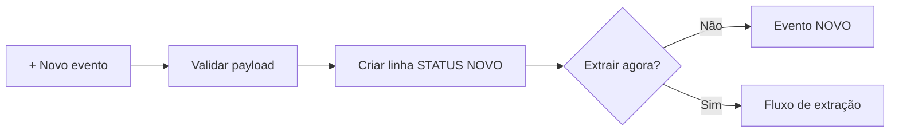

# FLUXOS.md

## 1. Novo evento

**Trigger:** usuária clica `+ Novo evento`.  
**Processamento:** `apiCriarEventoAB(payload)` valida campos, cria `ID_EVENTO`, adiciona linha em `EVENTOS` com `STATUS=NOVO`.  
**Validações:** links Drive de contrato/pasta; responsável; data/horário/local/Pax.  
**Resultado:** evento visível na sidebar. Se “Criar e já extrair” estiver marcado, o frontend chama a extração em uma chamada separada.  
**Erros:** a linha permanece criada mesmo se a extração falhar.

## 2. Extração do contrato

**Trigger:** ação `EXTRACAO`.  
**Processamento:**

1. validar evento;
2. abrir contrato PDF;
3. abrir links de aditivos já vinculados;
4. chamar `extrairContratoComIA()`;
5. normalizar saída;
6. limpar dados filhos atuais do evento;
7. gravar menu, terceiros e aditivos aplicados;
8. atualizar JSONs/valores/avisos;
9. `STATUS=AGUARDANDO_REVISAO`.

**Validações:** links, resposta OpenAI/schema, regras de identidade/aditivos.  
**Resultado:** estado contratual estruturado disponível para revisão.  
**Erros possíveis:** Drive inacessível, PDF inválido, OpenAI indisponível/schema, inconsistências; evento -> `ERRO`, LOG preenchido.

## 3. Revisão da extração no Web App

**Trigger:** abrir tab Revisão.  
**Processamento:** `apiObterRevisaoExtracaoAB()` carrega sob demanda cabeçalho, menu, terceiros, aditivos e avisos.  
**Validações:** revisão humana.  
**Resultado:** usuário pode editar cabeçalho e menu e salvar. `apiSalvarRevisaoExtracaoAB()` revalida dados.  
**Limitação:** terceiros/aditivos são exibidos, mas a UI atual não oferece edição equivalente para todos os registros; ver limitações.

## 4. Aprovar e gerar Escolha + Form Cliente

**Trigger:** ação `GERAR_ESCOLHA_FORM`.  
**Pré-condição:** dados aprovados e `validarDadosAntesDoFormulario()` sem bloqueios.  
**Processamento:**

- carregar dados;
- gerar Escolha DOC/PDF via template;
- criar Form Cliente;
- registrar Form na arquitetura central;
- salvar links/IDs;
- `STATUS=AGUARDANDO_CLIENTE`.

**Erros:** ausência de quantidade selecionável, template, Drive/Forms, registro central. Retentativa só quando segura.

## 5. Resposta do Form Cliente

**Trigger:** Google Sheets installable `onFormSubmit` na planilha central.  
**Processamento:**

1. localizar `FORM_REGISTRY` por response sheet;
2. se necessário, reconciliar via `Sheet.getFormUrl()`;
3. obter `META_JSON`;
4. localizar respostas ainda não processadas;
5. `processarRespostaCliente()`;
6. gravar `RESPOSTAS` tipo `CLIENTE`;
7. gerar Relatório de Degustação;
8. criar Form Interno;
9. atualizar EVENTOS para `AGUARDANDO_POS_DEGUSTACAO`;
10. fechar Form Cliente;
11. registry `PROCESSADO`, expiração imediata para limpeza.

**Resultado:** Relatório + Form Interno disponíveis.  
**Erros:** registry não encontrado, metadata inválido, criação de Doc/Form, trigger/permissão.

## 6. Criação do Form Interno

**Trigger:** processamento da resposta Cliente ou recriação explícita.  
**Processamento:**

- construir categorias do cardápio completo;
- obter escolhas degustadas;
- criar campos só onde aplicável;
- criar Camarim/Staff condicionais;
- criar `DateItem` para datas;
- gerar URL pré-preenchida com escolhas/datas;
- registrar no `FORM_REGISTRY`;
- salvar `LINK_FORM_INTERNO` e `FORM_INTERNO_ID`.

**Resultado:** Form Interno operacional.

## 7. Resposta do Form Interno

**Trigger:** mesmo `onCentralFormSubmit`.  
**Processamento atual V23.1:**

1. `registrarRespostaInternaParaAprovacao_()`;
2. gravar lote `INTERNO` em `RESPOSTAS`;
3. EVENTOS permanece `AGUARDANDO_POS_DEGUSTACAO`;
4. FORM_REGISTRY -> `RESPONDIDO_AGUARDANDO_GERACAO`;
5. **não gerar** Menu Final/OS.

**Resultado:** Web App detecta resposta e libera próximo passo.

## 8. Gerar Menu Final + OS

**Trigger:** Produção clica `Gerar Menu Final + OS`.  
**Processamento:**

1. validar existência/resposta do Form Interno;
2. obter metadata;
3. ler última resposta;
4. complementar com `RESPOSTAS` para compatibilidade;
5. resolver categorias/quantidades;
6. resolver formatos de serviço;
7. montar observações;
8. gerar Menu Final DOC/PDF;
9. gerar OS DOC/PDF;
10. EVENTOS -> `MENU_FINAL_E_OS_GERADOS`;
11. marcar Form Interno `PROCESSADO` e expirar em 14 dias.

**Validações:** templates finais, respostas, metadados.  
**Ajustes não bloqueantes:** faltas/excessos viram avisos/placeholders.  
**Resultado:** evento Finalizado.

## 9. Correção/reenvio do Form Interno

Forms Internos ficam ativos por 14 dias após geração final para permitir correções. Nova resposta nesse período pode ser registrada como nova pendência de geração.

`[PRECISA VALIDAR — operacionalmente, definir procedimento explícito para distinguir “correção intencional” de reenvio acidental após finalização.]`

## 10. Atualizar PDF após editar DOC

**Trigger:** aba Arquivos -> `Atualizar PDF`.  
**Processamento:**

1. localizar DOC pelo link;
2. converter versão atual para PDF;
3. se existir PDF, tentar `PATCH` Drive API no mesmo `fileId`;
4. se falhar, criar novo PDF na pasta, tentar mandar antigo à lixeira e atualizar campo do evento;
5. registrar LOG.

**Tipos:** `ESCOLHA`, `RELATORIO`, `MENU_FINAL`, `OS`.

**Resultado:** PDF sincronizado ao DOC atual.

## 11. Retentativa automática

**Trigger:** falha durante `apiExecutarAcaoAB()`.  
**Condição:** mensagem classificada como técnica transitória e ação segura contra duplicidade.  
**Processamento:** aguardar ~3s e executar segunda tentativa.  
**Resultado:** sucesso ou evento `ERRO`.  
**Não se aplica:** erros de validação/revisão.

## 12. Workflow de aditivo — análise

**Trigger:** Aditivos -> link + estágio -> `Analisar aditivo`.  
**Processamento:**

1. validar link/PDF;
2. impedir usar contrato base como aditivo;
3. impedir link já aplicado;
4. criar registro `PROCESSANDO` em `ADITIVO_WORKFLOW`;
5. enviar contrato + aditivos anteriores + novo aditivo à OpenAI;
6. receber vínculo, confiança e diff semântico;
7. status `ANALISADO`, `REJEITADO` ou `ERRO`.

**Mutação do estado contratual:** nenhuma.

## 13. Workflow de aditivo — aplicação

**Trigger:** usuária confirma `Aplicar ao evento`.  
**Pré-condições:** workflow `ANALISADO` ou retentativa `ERRO_APLICACAO`; `pertence_ao_contrato=true`; estágio válido.  
**Processamento:**

1. snapshot de estado e artefatos atuais;
2. adicionar link sem duplicação;
3. reexecutar extração completa com contrato + todos os aditivos;
4. normalizar estado novo;
5. comparar antes/depois;
6. gravar novo estado consolidado;
7. executar plano de fluxo por estágio;
8. salvar impacto, ação e artefatos anteriores no workflow.

### 13.1 Antes da degustação

**Resultado:** reabre `AGUARDANDO_REVISAO`, invalida versão atual dos artefatos posteriores e exige nova Escolha/Form Cliente quando houver impacto A&B.

### 13.2 Depois da degustação

**Resultado:** preserva Escolha/Relatório, cria novo Form Interno, limpa final atual e exige nova geração.

### 13.3 Após OS

**Resultado:** preserva links do Menu Final/OS anterior, cria novo Form Interno e exige nova versão final.

### 13.4 Somente financeiro

**Resultado:** atualiza consolidado/valores sem invalidar fluxo operacional.

## 14. Limpeza diária de Forms

**Trigger:** time-based diário, configurado para hora 4.  
**Processamento:** `limparFormsEscalaveisExpirados()` avalia registros expirados, fecha/desvincula Forms, remove aba temporária e arquiva registry.  
**Cliente:** expiração após primeira resposta.  
**Interno:** +14 dias após geração final.

## 15. Reset de ambiente de teste

**Trigger:** execução manual de `limparAmbienteTesteAB()` + confirmação literal `LIMPAR TESTES`.  
**Processamento:** arquiva Forms, limpa dados abaixo dos cabeçalhos, remove `FORM_META_*`, triggers legados e abas temporárias da central.  
**Não usar em produção com dados reais.**  
**Limitação:** script é anterior à `ADITIVO_WORKFLOW`; essa aba não está na lista de limpeza.
